# Multi-Filter Preprocessing Wizard for Siril

A Python scripting-console wizard for [Siril](https://siril.org/) that automates the entire preprocessing workflow for **multi-filter monochrome datasets** (LRGB, HOO/SHO narrowband, or any combination of filters) — from raw calibration through stacking, registration, a fully configurable per-filter post-processing pipeline, and an optional starmask composite — all through one guided, resumable, point-and-click interface.


*Carina Nebula (NGC 3372), an LRGB+Hα dataset from [Telescope.live](https://telescope.live/), taken all the way through the wizard's four phases and finished with an external compositing pass in GIMP.*

## Why this exists

This script is inspired by two great tools in the amateur astrophotography space: [**Sirilic**](https://siril.org/tools/) and [**Deepspace Astro's Workflow Companion**](https://www.deepspace.gallery/). Both automate parts of the Siril preprocessing workflow, and both were a big influence on how this wizard is structured.

I built this because for the past couple of months I've been using [Telescope.live](https://telescope.live/)'s remote imaging service, and all of their datasets are captured with monochrome cameras across multiple filters. Once my per-filter workflow settled into a predictable pattern, I used Claude AI to turn that pattern into a script — so the repetitive parts (stacking each filter, registering everything to a common frame, running the same post-processing steps filter by filter) happen once, consistently, instead of being manually repeated for every filter on every dataset.

## What it does

The wizard walks a dataset through four phases:

| Phase | What happens |
|---|---|
| **Phase 1 — Stacking** | Each filter's raw lights (optionally with darks/flats/biases) are calibrated and stacked into a single master image per filter, using Siril's `Mono_Preprocessing` `.ssf` scripts. |
| **Phase 2 — Registration & Crop** | All per-filter stacks are converted, registered to a shared reference frame, and cropped together so every filter lines up pixel-for-pixel. |
| **Phase 3 — Pipeline** | Each filter runs through the *same* configurable pipeline of post-processing steps — Background Extraction, Denoising, Sharpening, Star Removal, Stretching, plus any number of your own Misc/Other steps — using either Siril's built-in tools or your installed third-party Python scripts. |
| **Phase 4 — Starmask (optional)** | Combine any of the finished filters into an RGB, HOO, or manually-mapped color composite purely to use as a starmask reference, then run that composite through its own pipeline. |

What comes out the other end is a folder of finished, per-filter (and optionally starmask) images, ready for you to bring into an external editor for final color and luminance blending — the wizard shown here finished with a 6-layer composite in GIMP (LRGB Starmask, Hα, L, R, G, B) to produce the final image above. **The wizard handles calibration through per-filter processing; the final creative blend is yours.**

### Key features

- **One guided window** for the whole workflow — a persistent sidebar tracks every completed step, so you always know where you are and can scroll back through what's already been done.
- **Resumable at every step.** Close the wizard mid-run and reopen it later — it detects existing checkpoints and offers to resume, redo, or skip.
- **Same pipeline, every filter.** Configure your post-processing steps once; the wizard applies that exact sequence to each selected filter in turn.
- **Works with Siril's built-in tools *and* your own Python scripts** — background extraction, denoising, sharpening, star removal, and stretching tools are auto-detected from your installed scripts, with Siril's built-ins always available as a fallback.
- **Automatic tool discovery.** The wizard searches Siril's own configured script directories for recognized tools and remembers where it found them, so it doesn't need to re-scan your disk on every run.
- **Optional starmask compositing** (RGB, HOO, or manual channel mapping) as its own configurable pipeline, separate from the per-filter passes.
- **Organized output** — every run produces a predictable folder structure (`1 - Registration`, `2 - Pre-process`, `3 - Image Processing`) so your working files and finished images never get mixed up.
- **Optional cleanup** at the end of a run to remove intermediate folders once your finished images are safely copied out.

## Requirements

- **[Siril](https://siril.org/)** with Python scripting support (the `sirilpy` module), running in a version that supports the scripting console.
- **Python 3**, bundled with or accessible to your Siril installation.
- Your dataset organized by filter, as raw light frames (see [Dataset layout](#dataset-layout) below).
- **Optional but recommended:** third-party Python processing scripts for background extraction, denoising, sharpening, star removal, and stretching (e.g. tools like `AutoBGE.py`, `GraXpert-AI.py`, `CosmicClarity_Native.py`, `Starless.py`, and similar). The wizard auto-detects these if they're installed and visible to Siril's script search paths — Siril's own built-in tools (`subsky`, `denoise`, `atrous`, `unsharp`, `rl`, `ght`, `autostretch`, and others) always work as a fallback if you don't have any installed.

## Dataset layout

Before running the wizard, your dataset should be organized with one subfolder per filter, each containing its raw light frames (and calibration frames, if you're using them):

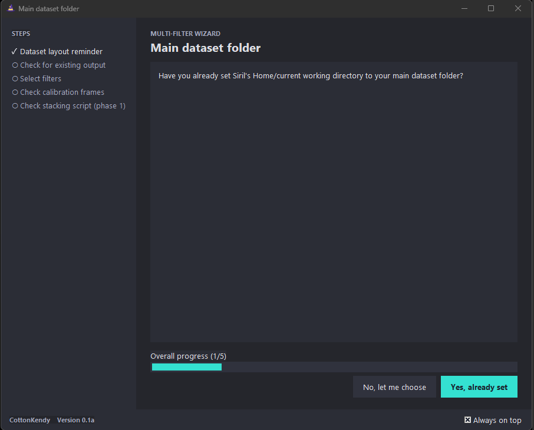

The wizard reminds you of the expected layout every time it starts:

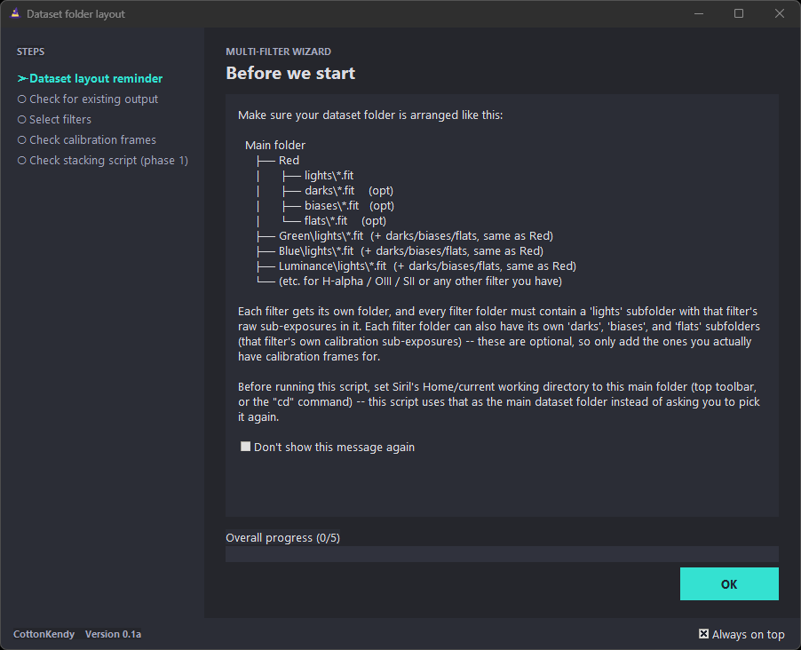

## Walkthrough

### 1. Select your filters

Pick which filter subfolders from your dataset to include in this run.

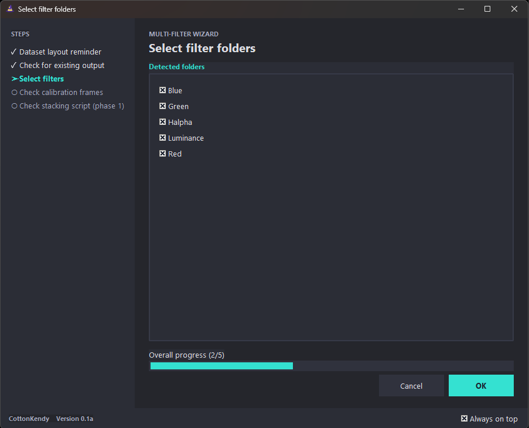

### 2. Calibration frames

For each filter, choose which calibration frames are available — darks, flats, biases, any combination, or none — which determines which `Mono_Preprocessing` `.ssf` variant is used for stacking.

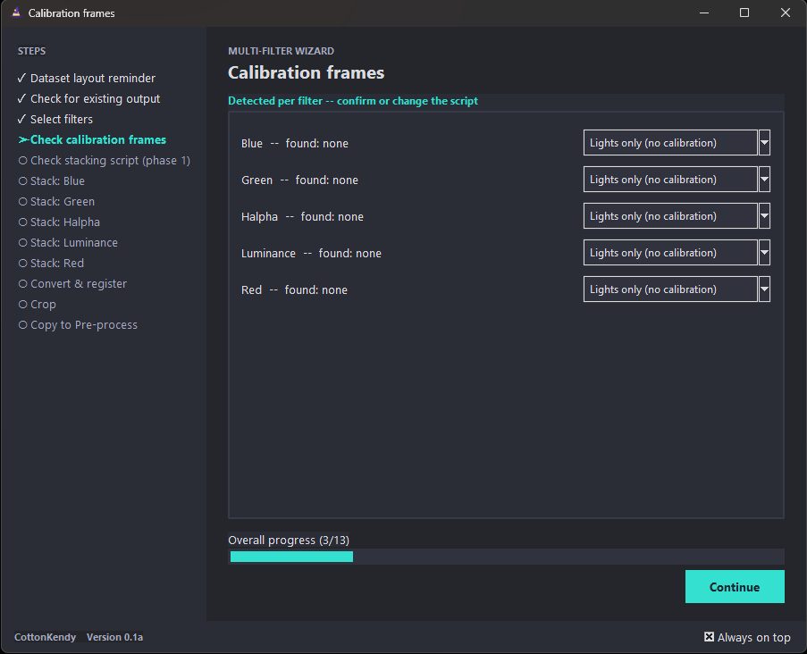

### 3. Stack each filter

The wizard runs Siril's stacking script for each selected filter in turn.

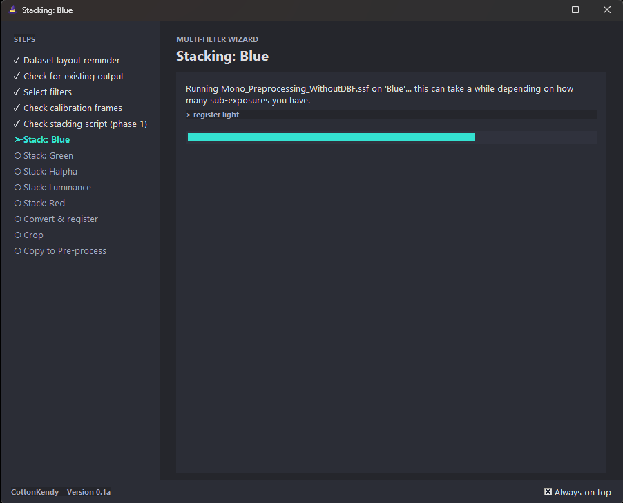

### 4. Convert, register, and crop

Once every filter is stacked, the wizard converts and registers all of them to a common reference frame, then opens a crop tool so you can trim the aligned sequence to the region you want to keep across every filter at once.

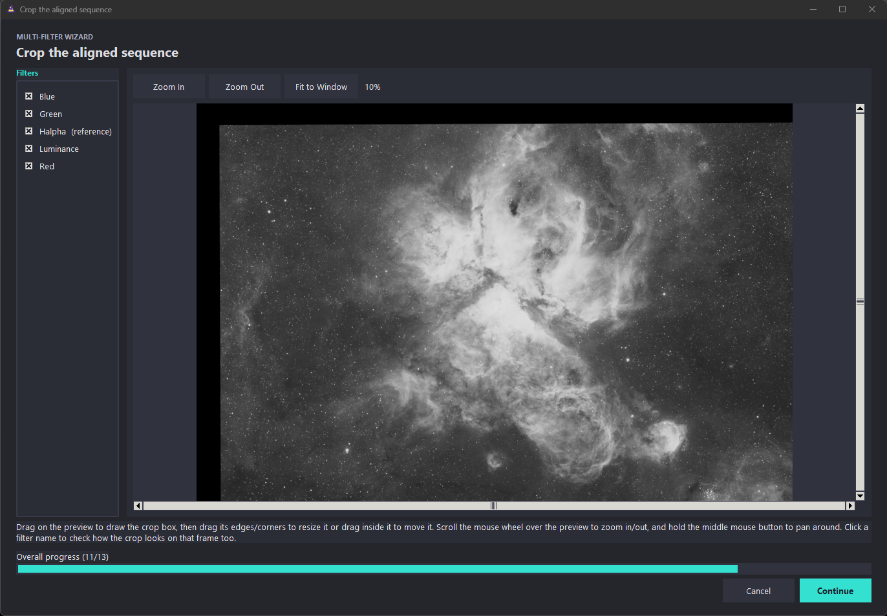

### 5. Configure your Phase 3 pipeline

Arrange the order of your post-processing steps — Background Extraction, Denoising, Sharpening, Star Removal, Stretching, and any Misc/Other steps you want to add — once. This same sequence is then applied to every selected filter.

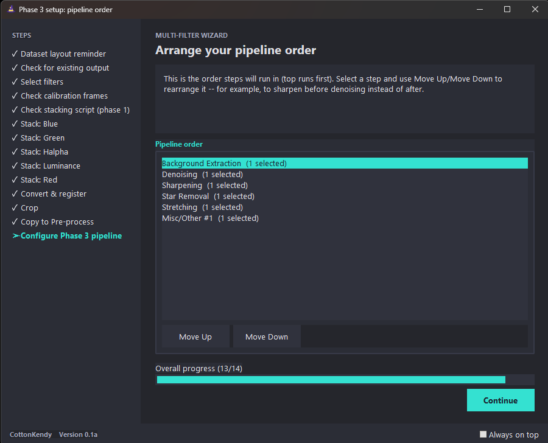

For each step, pick the tool to use: skip it entirely, use a Siril built-in, or use one of your auto-detected installed scripts.

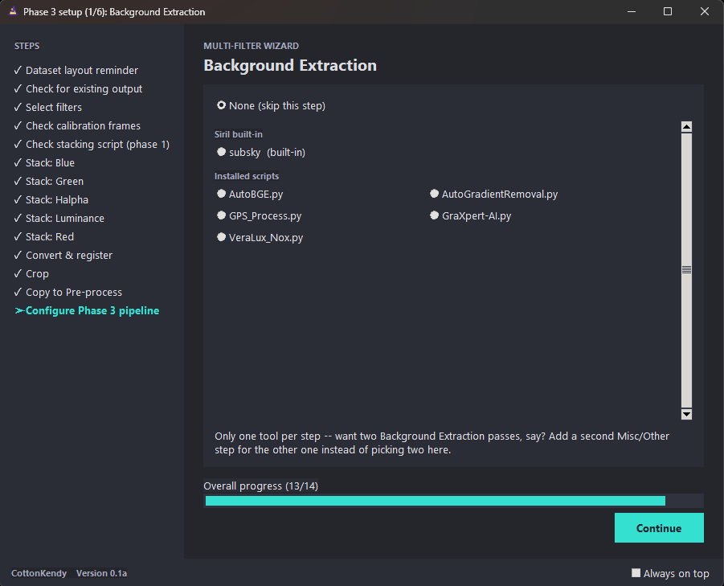

### 6. Run the pipeline, filter by filter

The wizard walks each filter through your configured pipeline, opening each tool in turn and saving a checkpoint after every step so you can pause, resume, redo, or skip without losing progress.

Once every filter has completed the full pipeline, Phase 3 is done:

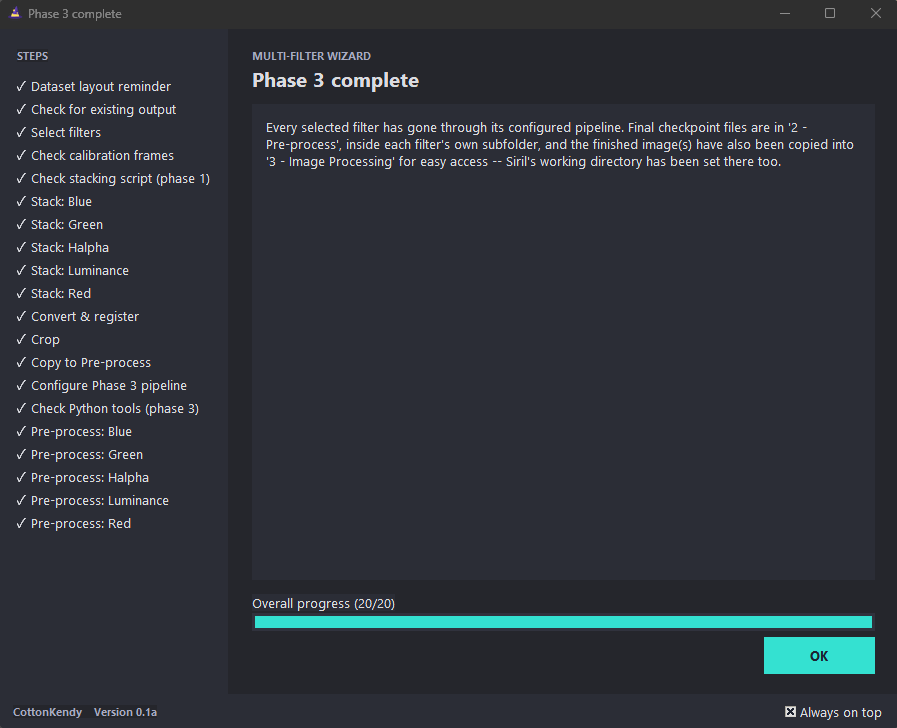

### 7. (Optional) Build a starmask

If you want a separate starmask reference — useful for star-reduction or star-recombination work later — the wizard can combine your finished filters into an RGB or HOO composite (or a manual channel mapping) purely for that purpose.

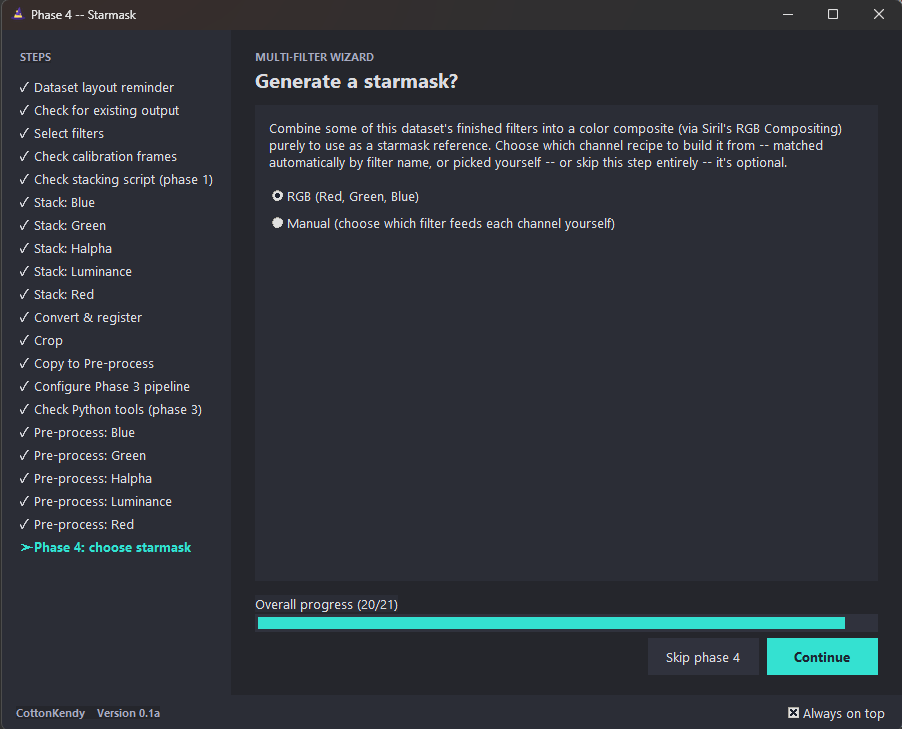

That composite then runs through its own configurable pipeline, just like an individual filter:

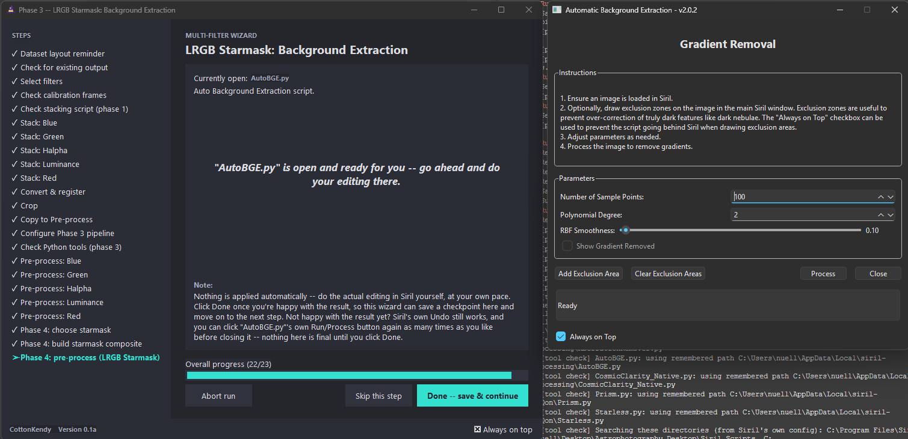

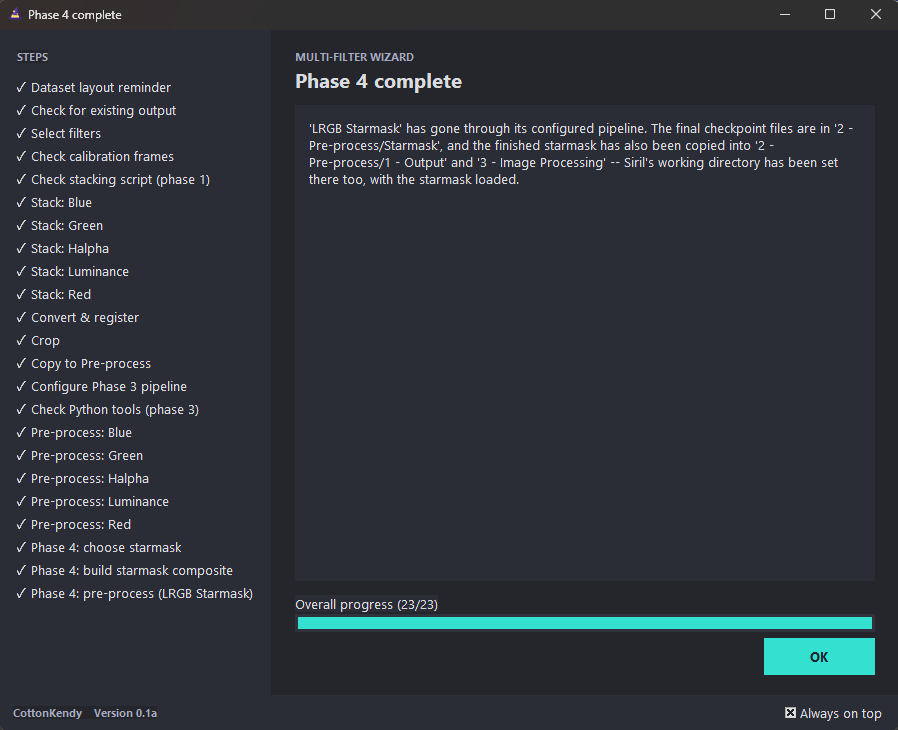

### 8. Clean up (optional)

Once your finished images are safely copied into `3 - Image Processing`, the wizard offers to delete the intermediate `1 - Registration` and `2 - Pre-process` folders to free up disk space — or keep them around in case you want to redo a step later.

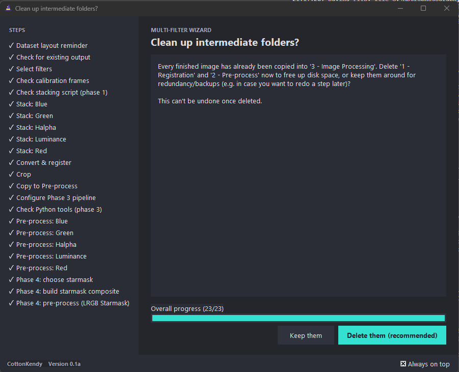

## Output structure

Each run produces the following folder structure inside your dataset:

```
Your Dataset/
├── 1 - Registration/        # Converted & registered sequences (intermediate)
├── 2 - Pre-process/          # Per-filter stacking + pipeline working files
│   ├── <Filter>/
│   │   ├── Raw/
│   │   ├── Process/
│   │   └── Output/
│   └── ...
└── 3 - Image Processing/     # Final, finished images — ready for external editing
    ├── 1 - Output/
    └── Starmask/              # If Phase 4 was run
```

### Finishing the image

The wizard's job ends at `3 - Image Processing` — a set of finished, per-filter (and optionally starmask) images. From there, final color combination, luminance blending, and any additional creative editing happens in an external image editor of your choice. The example at the top of this README was finished with a 6-layer composite (LRGB Starmask, Hα, L, R, G, B) in GIMP:

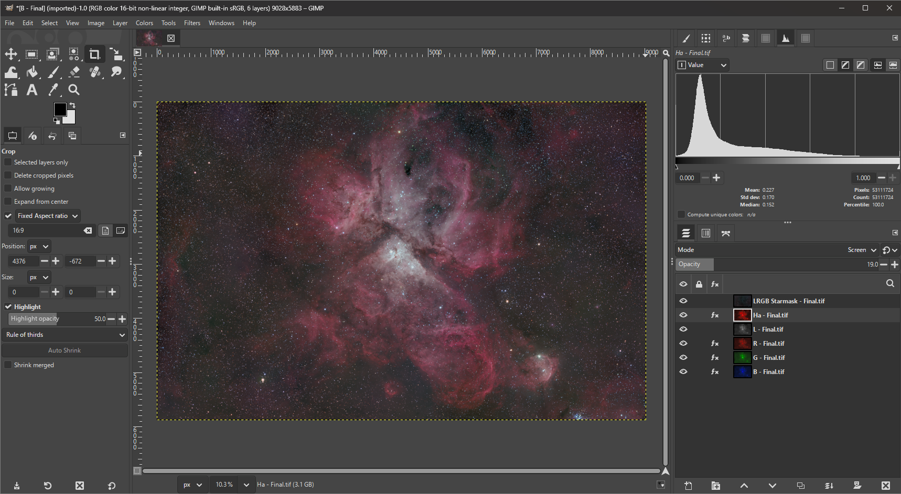

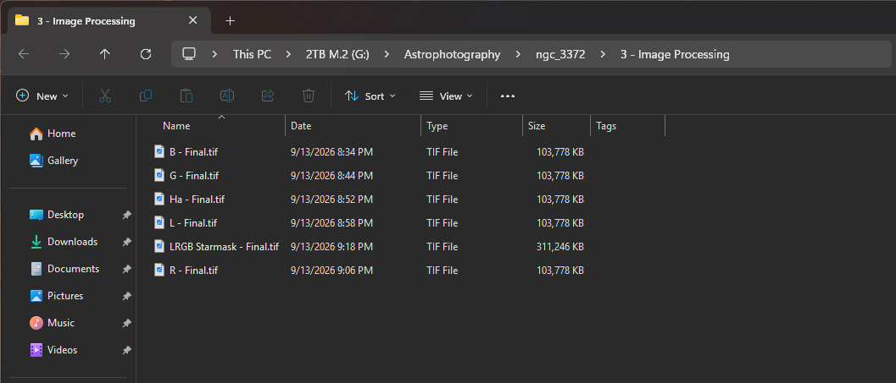

## Resuming a run

The wizard checkpoints its progress after every meaningful step (stacking, registration, crop, and each individual pipeline step per filter). If you close it and come back later — or restart Siril entirely — reopening the wizard on the same dataset detects the existing checkpoints and lets you resume exactly where you left off, redo a step you're not happy with, or skip ahead.

## Credits

- Inspired by [**Sirilic**](https://siril.org/tools/) and [**Deepspace Astro's Workflow Companion**](https://www.deepspace.gallery/).
- Built for a monochrome, multi-filter workflow shaped by processing [Telescope.live](https://telescope.live/) datasets.
- Built with [Siril](https://siril.org/) and its Python scripting API (`sirilpy`).
- Developed with the assistance of Claude AI.
